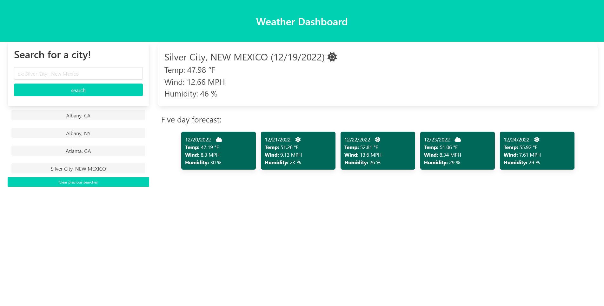

<WEATHER-FORECAST>

# 5-Day Weather Forecast

[Try it out](https://mkalik.github.io/module6-weather-dashboard/)

## 1.Installation:

clone this repo and start open the index.html file in your browser. 

## 2.Usage:

A 5 day weather forecast for the USA that can aid in the planning of trips.

## 3.Credits:

All work done by Malik Kouyate(mkalik)

This program makes use of the OpenWeather API, [found here](https://openweathermap.org/api).

(Used the 5-day forecast api, the current weather data api, and the Geocoding api)

The styling was done via [Bulma](https://bulma.io/documentation/) And the icons were generated via [Font Awesome](https://fontawesome.com/)

